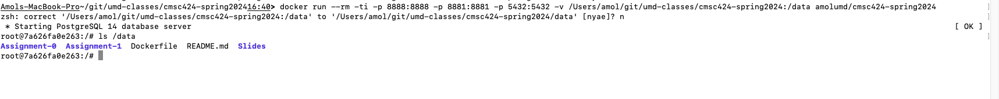

## Brief Setup Instructions 

There are some more detailed instructions in the README.md files within `Assignment-?/` directories.

1. Clone the GitHub Class Repository to get started (there are more detailed instructions in `Assignment-0` README):
`git clone https://github.com/umddb/cmsc424-spring2024.git`

1. You can load the different database systems directly on your machines (easier on Linux or Mac), but to make things easier, we have provided a Docker Image with
PostgreSQL, MongoDB, and Spark pre-loaded (we may update the image later if needed).
    - Install Docker Desktop: https://www.docker.com/products/docker-desktop
    - Run the docker image: `docker run --rm -ti -p 8888:8888 -p 8881:8881 -p 5432:5432 -v /Users/amol/git/cmsc424-spring2024:/data amolumd/cmsc424-spring2024`. 
    - Make sure to replace `/Users/amol/git/cmsc424-spring2024` with the correct path of the `top level directory` in the cloned GitHub repository. 
    - The above command mounts the local GitHub directory into `/data` on the virtual machine. Do `ls /data` in the virtual machine to confirm that you can see `Assignment-0` directory in there. Make all your changes in that directory itself -- any changes elsewhere in the container will not survive when you exit it.
    - Assuming it ran successfully, you should be logged in as `root` in the docker container, and you should see the shell.
    
    - The above command maps three ports on the container: 8888, 8881, and 5432 (PostgreSQL). This means that if you go to 'http://127.0.0.1:8888', you will
    actually be connecting to the 8888 port on the virtual machine (on which we are running the Jupyter Notebook). However, if your computer is already using these
    ports, you will have to modify those (see below). 
    - NOTE: you will be logged in as `root`.
    - At this point, you should be able to use psql: `psql university`
    - Jupyter Notebook should be pre-started (try http://127.0.0.1:8888), but if not, you can do: `jupyter-notebook --port=8888 --allow-root --no-browser --ip=0.0.0.0` inside the virtual machine.
    - As soon as you exit the Docker container, the machine will shut down -- so only changes you have made in the /data directory will persist.

1. Confirm that the StackExchange database is also properly loaded into PostgreSQL.
    - Do `psql stackexchange` inside the virtual machine.
    - Assuming that started correctly, check that there are 7 tables in the schema using `\d`
    - Check that there is data in the tables (e.g., `select * from posttypes;`)

1. Confirm that MongoDB is setup properly.
    - Run `mongosh zips` inside the VM.
    - Check that you are able to run a query within mongosh.
         - `db.examples.find({})` should return all documents within the "examples" collection.
         - `db.examples.find({ "_id": '01039'})` should return a single JSON document.
    - Check that the other dataset that's loaded is also there.
         - `mongosh analytics`
         - `db.customers.find({})`, `db.transactions.find({})`, `db.accounts.find({})` should all return results.

1. Confirm that Spark is setup properly. We won't elaborate on what's going on right now -- the goal is to identify potential issues in running Spark.
   - Inside the VM, confirm that SPARKHOME is set correctly (`echo $SPARKHOME` should return `/spark`)
   - Run: `$SPARKHOME/bin/pyspark` -- this starts a standard python shell with Spark modules loaded and some initialization done.
   - In the python shell, run `sc.textFile("/data/README.md").take(5)`
   - The output should be an array with the first 5 lines of the README.md file.

1. If you are having trouble installing Docker or somewhere in the steps above, you can also install the software directly by going through the commands listed in
the Dockerfile.

## Important: Read before Visiting Office Hours for Errors

1. If you run into issues installing Docker Desktop, do Google searches on the errors to see if there are any instructions to fix those. That's what we would do if you
come to office hours. 

1. If you run into issues running the docker image (using `docker run`), post a screenshot of the error in Piazza. The most likely error I can imagine is port mapping.
For example, if it complains that port 8888 is already used, then just modify the above command to use `-p 8889:8888` instead. If that works, then to use Jupyter
notebook, you would have to go to: http://127.0.0.1:8889 instead of the link provided above.

1. Assuming no errors in running docker image, I am not sure why either PostgreSQL or Jupyter Notebook wouldn't work, but we will update this section if we see more
errors.

## Prompt for ChatGPT/Claude/Perplexity etc.

We suggest using an LLM-based engine to handle any issues to the extent possible. Here is a prompt you can cut-n-paste if you'd like.

As usual, be aware that LLMs can hallucinate (especially ones with older cutoffs like ChatGPT-3.5) and may provide incorrect information.

```
See the following instructions to set up PostgreSQL, MongoDB, and Apache Spark for an undergraduate class in Databases. Confirm that you have read it and that you can answer my clarifying questions on this.

<COPY THE RELEVANT TEXT FROM "BRIEF SETUP INSTRUCTIONS" ABOVE>

```
